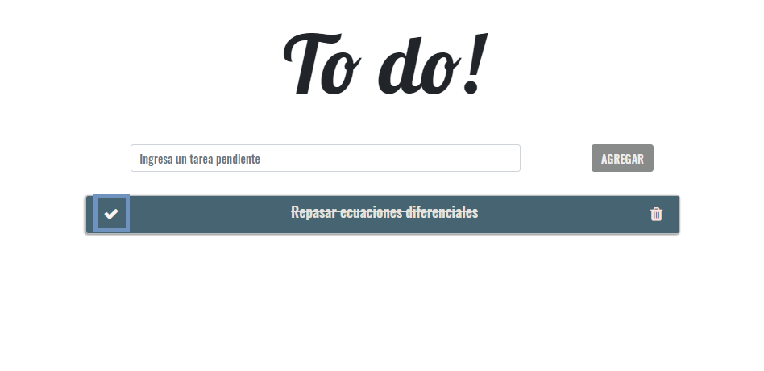

# Simple todo list

## Contenido

### Uso
   * [Página de inicio](#inicio)
   * [Agregar tareas](#nueva-tarea)
   * [Marcarlas como hechas](#tarea-hecha)
   * [Eliminar tareas](#eliminar-tarea)

### Pagina de inicio

### Agregar tareas

### Marcarlas como hechas

### Marcada como hecha

### Pagina de inicio
